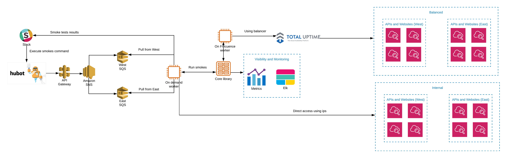

## Production architecture



## Local run Smoke Test

1. Navigate to core folder 

```
    cd smoke-test/core
```

2. Execute the command with a specific [group](https://github.com/cebroker/ec-tests-stack/wiki/JSON-Secret-Manager-Structure) or regrex patten string, example `evercheck.com` or `prehire`

```
    npm run test $group // The smoke test will be executed to `stage production`
```

```
    npm run test:demo $group // The smoke test will be executed to `stage demo`
```

```
    npm run test:test $group // The smoke test will be executed to `stage test`
```

## Run Smoke Test sheduled in `slack channel`


Depending on the environment and datacenter will be the instruction to the bot

Example:

Type in the channel 

```
    @xina test smoke test jax evercheck.com
```


@xina will answer you, and xina's butler will answer with the result of the test

```
    :check: Running smoke test for jax in test environment and group evercheck.com
```

```
xina's butler 
    Smoke Results in TEST on JAX datacenter
        See all results in elk.test.evercheck.com
            [test] api.test.evercheck.com/v1/api-status :white_check_mark: (3)
            [test] test.evercheck.com/api/ :white_check_mark: (3)
            [test] apiv2.test.evercheck.com/ :white_check_mark: (1)
```

### Command explanation @xina help


```
@xina help: Display all available commands.
@xina test smoke environment datacenter group: Run smoke tests.
@xina help test smoke environment: Display all posible environments.
@xina help test smoke datacenter: Display all posible datacenters.
@xina help test smoke group: Display all posible groups.

```


## Metrics


After the smoke tests are launched, the results are sent to metrics for graphing, keep in mind that the DNS shown depends on the environment in which the smoke test was scheduled. There are two graphics boards:

.


### System Availability (Internal): 

Shows metrics for smokes tests scheduled from the slack channel

### System Availability (Geo-Balancing)

This feeds on the runs of the smoke tests scheduled automatically every 5 minutes in the on-frequence instances for each zone (east | west) 


